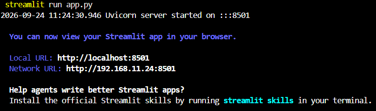
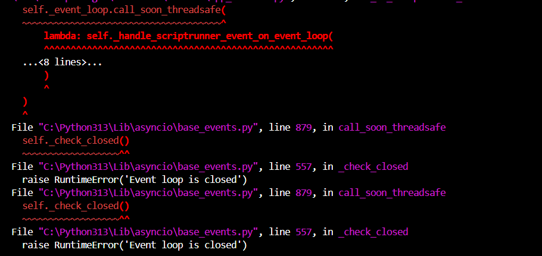

# 💭 Reflection: Game Glitch Investigator

Answer each question in 3 to 5 sentences. Be specific and honest about what actually happened while you worked. This is about your process, not trying to sound perfect.

## 1. What was broken when you started?

- What did the game look like the first time you ran it?
  - It looks good and from a glance, it looked finished.
  - It had a **sidebar** with "Settings" as it header, a Difficulty select box having options Easy, Normal, and Hard defaulting to Normal, 
  a caption that displayed the number of attempts per difficult per difficulty and 
  another caption stating the range per difficulty.
    - Attempt captions
      - 6 for Easy difficulty
      - 8 for Normal difficulty
      - 5 for hard difficulty
    - Range captions:
      - 1 to 20 when the diffculty field easy option was picked
      - 1 to 100 when the diffculty field normal option was picked
      - 1 to 50 when the diffculty field hard option was picked

  - It has a **main panel** that has a big header, Game Glitch Investigator,
  a blue info banner stating the range and attempts left, a "Developer Debug Info" expander listing the secret, attempts, score, difficulty, and history, a text input for the guess, and a row with Submit Guess, New Game, and a "Show hint" checkbox. Submitting a guess produced a yellow warning banner with the hint [[1]](#1).
    - It has a blue block that always says the generated number to find in the game ranges from 1 to 100 and provides the number of attempts remaining even when the number is not in that range. 
    - It has an accordian that tells the number of attempts, the score, and history.
    - Below the accordian it has an input field where users can guess the number.
    - Below the input field there is a section that provides buttons from left to right
    to submit the guess and to start a new game. In that row where the submit and new game buttons are, there is check input field that allows users to decide whether hints should show or not.
    - There is a yellow block that appears when users submit a number that is suppose to
    provide hints.

 

> *Terminal output documenting the game was run before any code changes*

- List at least two concrete bugs you noticed at the start  
  (for example: "the hints were backwards").
    - **1. In **sidebar** listed Ranges does not correspond with the range of numbers the secret  number to guess is between"**
      - The Range field in the sidebar seems misleading as they do not correspond to the range of numbers that the random number can be in. 
    - **2. in the **sidebar** Difficulty doesn't scale coherently [[1]](#1)
      - Normal grants the most attempts (8) against the widest range (1 to 100), while Hard grants the fewest (5) against a narrower range (1 to 50), so "Hard" is not reliably harder than "Normal" [[1]](#1).
    
    - **3. "Attempts left" in the blue box in the **Main Panel** is off by one and lags a turn behind.**
      - The blue block in the **main panel** provides an inaccurate number of the attempts left. It is one off.      
        - Before the user inputs their guessed number when the game starts the blue block in normal difficulty says user has 7 attempts even when they have 8. 
        - The "Attempts left" number does not change after the user inputs their first guess to the application, but changes and decrements starting from the user's second attempt onward
  
      **4. Inaccurate range in the blue block**
        - It keeps stating: "Guess a number between 1 and 100." no matter what the range stated in the **side bar** is.
      
      **5. The debug expander shows stale state for the same reason [[1]](#1)**
      - The Attempts field in the expander starts with 1 even though when the game starts no attempts were made.
      - The Attempts field does not update upon user inputing and submitting their first guess. It updates upon user changing the input field to provide guessed number upon second attempts and onward.
      - When the user guesses the number, the expander only shows the updated score upon the next guess. 
      - The history field in the exapnder, only shows the last number that the user guessed upon submitting another guessed number after it, not immediately upon user submitted the guessed number. 
        - For example, user inputs 10 on the input field on first try and then clicks the submit button, the history field in the accordian will not show it. After the user inputs another number, for example 45 and then clicks the submit button, the history field will show only that the user only inputted number 10 for the current playthough.
    

    **6. The hints were backwards**
      - When I guess a number that is <i>higher</i> than the secret number to find in the game, the hints say to "Go LOWER!". 
      - When I guess a number that is <i>lower</i> than the secret number to find in the game, the hints say to "Go HIGHER!".

    **7. The "New Game" button does not start a new game. It is non-functional. Nothing appears to reset**
  
   

> *Terminal output documenting some errors shown while running the game before any code changes*

**Bug Reproduction Log**

Document at least 3 bugs you found. Add rows as needed.

| Input | Expected Behavior | Actual Behavior | Console Output / Error |
|-------|-------------------|-----------------|------------------------|
| | | | |
| | | | |
| | | | |

---

## 2. How did you use AI as a teammate?

- Which AI tools did you use on this project (for example: ChatGPT, Gemini, Copilot)?
- Give one example of an AI suggestion that was correct (including what the AI suggested and how you verified the result).
- Give one example of an AI suggestion you did not accept as written (including what the AI suggested, why you rejected or changed it, and how you verified your version). It does not have to be a suggestion that was wrong: over-engineered, out of scope, harder to read, or a poor fit for this codebase all count.

---

## 3. Debugging and testing your fixes

- How did you decide whether a bug was really fixed?
- Describe at least one test you ran (manual or using pytest)  
  and what it showed you about your code.
- Did AI help you design or understand any tests? How?

---

## 4. What did you learn about Streamlit and state?

- How would you explain Streamlit "reruns" and session state to a friend who has never used Streamlit?

---

## 5. Looking ahead: your developer habits

- What is one habit or strategy from this project that you want to reuse in future labs or projects?
  - This could be a testing habit, a prompting strategy, or a way you used Git.
- What is one thing you would do differently next time you work with AI on a coding task?
- In one or two sentences, describe how this project changed the way you think about AI generated code.

<a id="1">[1]</a>: Anthropic. Claude Pro. https://claude.ai. 
  - I asked it to improve my document by making it easier to read and understand. Initially it remade the reflection.md file but, I rejected much of the content it generated as I wanted to better document applications myself and use AI ethically.
  - It explained the **main panel** succintly
  - I learned more on writting descriptions succintly.