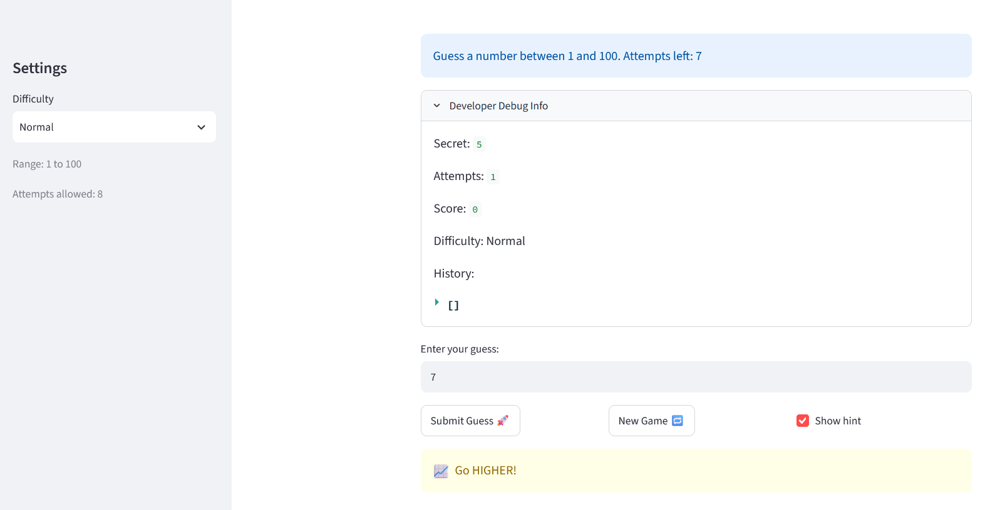
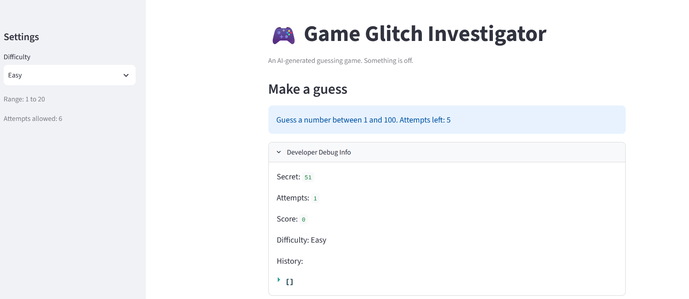
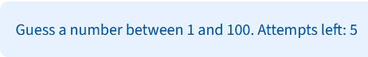

# 💭 Reflection: Game Glitch Investigator

Answer each question in 3 to 5 sentences. Be specific and honest about what actually happened while you worked. This is about your process, not trying to sound perfect.

## 1. What was broken when you started?

- What did the game look like the first time you ran it?
  - It looks good and from a glance, it looked finished.
  - It had a **sidebar** with "Settings" as it header, a Difficulty select box having options Easy, Normal, and Hard defaulting to Normal, 
  a caption that displayed the number of attempts per difficult per difficulty and 
  another caption stating the range per difficulty.
    - Attempt captions
      - 6 for Easy difficulty
      - 8 for Normal difficulty
      - 5 for hard difficulty
    - Range captions:
      - 1 to 20 when the diffculty field easy option was picked
      - 1 to 100 when the diffculty field normal option was picked
      - 1 to 50 when the diffculty field hard option was picked

  - It has a **main panel** that has a big header, Game Glitch Investigator,
  a blue info banner stating the range and attempts left, a "Developer Debug Info" expander listing the secret, attempts, score, difficulty, and history, a text input for the guess, and a row with Submit Guess, New Game, and a "Show hint" checkbox. Submitting a guess produced a yellow warning banner with the hint [[1]](#1).
    - It has a blue block that always says the generated number to find in the game ranges from 1 to 100 and provides the number of attempts remaining even when the number is not in that range. 
    - It has an accordian that tells the number of attempts, the score, and history.
    - Below the accordian it has an input field where users can guess the number.
    - Below the input field there is a section that provides buttons from left to right
    to submit the guess and to start a new game. In that row where the submit and new game buttons are, there is check input field that allows users to decide whether hints should show or not.
    - There is a yellow block that appears when users submit a number that is suppose to
    provide hints.

<br/>
<div>

</div>


> *Terminal output documenting the game was run before any code changes*


- List at least two concrete bugs you noticed at the start  
  (for example: "the hints were backwards").
    - **1. In **sidebar** listed Ranges does not correspond with the range of numbers the secret  number to guess is between"**
      - The Range field in the sidebar seems misleading as they do not correspond to the range of numbers that the random number can be in. 
    - **2. in the **sidebar** Difficulty doesn't scale coherently [[1]](#1)
      - Normal grants the most attempts (8) against the widest range (1 to 100), while Hard grants the fewest (5) against a narrower range (1 to 50), so "Hard" is not reliably harder than "Normal" [[1]](#1).
    
    - **3. "Attempts left" in the blue box in the **Main Panel** is off by one and lags a turn behind.**
      - The blue block in the **main panel** provides an inaccurate number of the attempts left. It is one off.      
        - Before the user inputs their guessed number when the game starts the blue block in normal difficulty says user has 7 attempts even when they have 8. 
        - The "Attempts left" number does not change after the user inputs their first guess to the application, but changes and decrements starting from the user's second attempt onward
  
      **4. Inaccurate range in the blue block**
        - It keeps stating: "Guess a number between 1 and 100." no matter what the range stated in the **side bar** is.
      
      **5. The debug expander shows stale state for the same reason [[1]](#1)**
      - The Attempts field in the expander starts with 1 even though when the game starts no attempts were made.
      - The Attempts field does not update upon user inputing and submitting their first guess. It updates upon user changing the input field to provide guessed number upon second attempts and onward.
      - When the user guesses the number, the expander only shows the updated score upon the next guess. 
      - The history field in the exapnder, only shows the last number that the user guessed upon submitting another guessed number after it, not immediately upon user submitted the guessed number. 
        - For example, user inputs 10 on the input field on first try and then clicks the submit button, the history field in the accordian will not show it. After the user inputs another number, for example 45 and then clicks the submit button, the history field will show only that the user only inputted number 10 for the current playthough.
    

    **6. The hints were backwards**
      - When I guess a number that is <i>higher</i> than the secret number to find in the game, the hints say to "Go LOWER!". 
      - When I guess a number that is <i>lower</i> than the secret number to find in the game, the hints say to "Go HIGHER!".

  
  <br/>
<div>

</div>


> *Terminal output documenting some errors shown while running the game before any code changes*

**Bug Reproduction Log**

Document at least 3 bugs you found. Add rows as needed.

| Input | Expected Behavior | Actual Behavior | Console Output / Error |
|-------|-------------------|-----------------|------------------------|
|Difficulty = Normal, secret = 76 (from Developer Debug Info). Submit a guess of 20| 20 < 76, so the app should report **Too Low** and give a hint of *Go LOWER* | App reports **Too High** and it gives a hint of  *Go HIGHER*  | No traceback — a TypeError: '>' not supported between instances of 'int' and 'str' is raised and silently swallowed by the except TypeError fallback. [[2]](#2). Also [look at failed test case](#3) |
|Set difficulty to Normal |Range is 1, 50 | Range is 1, 100|[Look at failed test case](#4) |
|Set difficulty to Hard |Range is 1, 100 | Range is 1, 50|[Look at failed test case](#5) |
|The input is Easy, Normal and Hard.When difficulty is Easy, Normal| The **Secret** always has a range from 1 to 100 despite the difficulty set. When difficulty is Easy, Normal, Hard secret should be in range from 1 to 30, 50, and 100 respectively. Regardless whether user just started the application or clicked new game | Secret is always between 1 to 100. It can be greater than 20 and 50 regardless of the difficulty chosen. The default difficulty when setting the secret is always "Normal".|[Look at the error](#6) |
| Guess 40, secret is 50, and user clicks submit button |The history list in the UI is not showing the guess upon submit. | The history list should show the guess | The history of the guesses has some laging. The user submits a guess and their guess is not showing in the history list in the UI unless they submit it again. |
| Guess 40 and it is the first guess, secret is 50, and user clicks submit button |The **score** should update immediately with a score of -5. the guess | The score is showing as 0, The score field in the UI is not showing any updated score.| The score is not updated immediately upon the submitted Also [See picture](#3)|
| The difficulty selected to Easy | The **main panel** should show "Guess a number between 1 and 20." |It shows "Guess a number between 1 and 100. "| The **main panel** always shows "Guess a number between 1 and 100." regardless of difficulty. It should represent the range of the secrets based on the difficulty user selected [See picture](#7).|
---

## 2. How did you use AI as a teammate?

- Which AI tools did you use on this project (for example: ChatGPT, Gemini, Copilot)?
  - I primarily used Claude and GitHub Copilot for this project.
- Give one example of an AI suggestion that was correct (including what the AI suggested and how you verified the result).
  - I wanted to find why the history list that the game would show required users to submit
  another guess for their previous game to be recorded and shown in it.
  According to GitHub Copilot to fix this issue: 

```bash
The history is appended when you click Submit, but the app displays it earlier in the script. The “Developer Debug Info” expander writes st.session_state.history before the submit handler runs, so Streamlit’s rerun shows the previous history; your new guess appears on the next rerun, which makes it look like you need to submit twice.

Move the history display below the submit handler (or render it in a placeholder that you update after appending). The append itself is happening on the first submit. You can see the render and append order in app.py:47 and app.py:94.
```
- Give one example of an AI suggestion you did not accept as written (including what the AI suggested, why you rejected or changed it, and how you verified your version). It does not have to be a suggestion that was wrong: over-engineered, out of scope, harder to read, or a poor fit for this codebase all count.

---

## 3. Debugging and testing your fixes

- How did you decide whether a bug was really fixed?
  - I used what I would normally consider to be correct such as giving hints to tell users to guess lower when they guessed a higher number than the secret number to guess and that more challenging difficulties such Hard over Normal should have a wider range. I then essentially made an acceptance criteria it had to pass. I would run the UI and if it showed to be running correctly I would mark it as correct. 
  - Also I made test cases with pytest, which had to pass as well.
- Describe at least one test you ran (manual or using pytest)  
  and what it showed you about your code.
    - I tested if I were to take out a conditional [Look at the bug](#6) int the code
    and modify the code to also show the secret in the tab bar, why the secret generated
    had no relation to what difficulty the user picked.
    - I also made unit tests using Pytest to find whether the hints that were backward telling users to guess higher when they made a guess that was hire than the secret, the secret number to guess. Her is a test I made with Pytest for this application, [hint test case](#3).
- Did AI help you design or understand any tests? How?

---

## 4. What did you learn about Streamlit and state?

- How would you explain Streamlit "reruns" and session state to a friend who has never used Streamlit?

---

## 5. Looking ahead: your developer habits

- What is one habit or strategy from this project that you want to reuse in future labs or projects?
  - This could be a testing habit, a prompting strategy, or a way you used Git.
- What is one thing you would do differently next time you work with AI on a coding task?
- In one or two sentences, describe how this project changed the way you think about AI generated code.

## 6. Citations and Extra Notes

<a id="1">[1]</a>: Anthropic. Claude Pro. https://claude.ai. 
  - I asked it to improve my document by making it easier to read and understand. Initially it remade the reflection.md file but, I rejected much of the content it generated as I wanted to better document applications myself and use AI ethically.
  - It explained the **main panel** succintly
  - I learned more on writting descriptions succintly.

<a id="2">[2]</a>: Anthropic. Claude Pro. https://claude.ai. 
  - I asked Claude to find a bug and fufill the documentation noting it in the reflection.md file.
    - I previous found the error it documented when I was playing with the application when it was running on a browser. It said to submit two guess to find the error. Two guesses were not needed. The results and hints came after submitted the first guess I made so I modified it stating it needs only one guess and documented the same error but with different inputs testing the application in the browser.. <a href="ai_interactions.md"> See ai_interactions.md</a>.

  - It completed a row in the Bug Reproduction Log that provided information on a bug it found. The bug it found was the backward hints. 
  - It guided me on how to report bugs for this project and
  how to make tables in .md files.

<a id="3">[3]</a>:
```bash
FAILED tests/test_game_logic.py::test_guess_too_high - AssertionError: assert '📈 Go HIGHER!' == '📉 Go LOWER!'
FAILED tests/test_game_logic.py::test_guess_too_low - AssertionError: assert '📉 Go LOWER!' == '📈 Go HIGHER!'
```
<div>

</div>
<a id="4">[4]</a>:
```bash
    def test_get_range_for_difficulty_normal():
        # On normal difficulty, the range should be from 1 to 50
        range = get_range_for_difficulty("Normal")
>       assert range == (1, 50)
E       assert (1, 100) == (1, 50)
E         
E         At index 1 diff: 100 != 50
E         Use -v to get more diff
```

<a id="5">[5]</a>:
```bash
    def test_get_range_for_difficulty_hard():
        # On nhard difficulty, the range should be from 1 to 100
        range = get_range_for_difficulty("Hard")
>       assert range == (1, 100)
E       assert (1, 50) == (1, 100)
E         
E         At index 1 diff: 50 != 100
E         Use -v to get more diff

```
<a id="6">[6]</a>:
<br/>
<div>

</div>
<br/>

```bash
if "secret" not in st.session_state:
    st.session_state.secret = random.randint(low, high)
    # The conditional is the suspected bug. This code is in app.py
```
<a id="7">[7]</a>:
<br/>
<div>

</div>